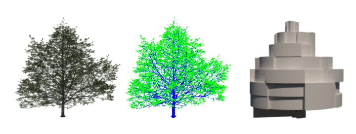
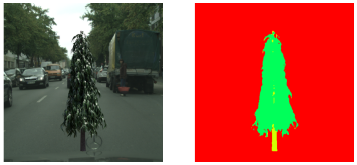
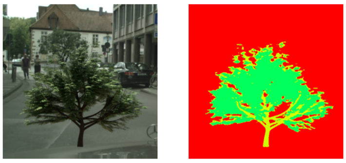
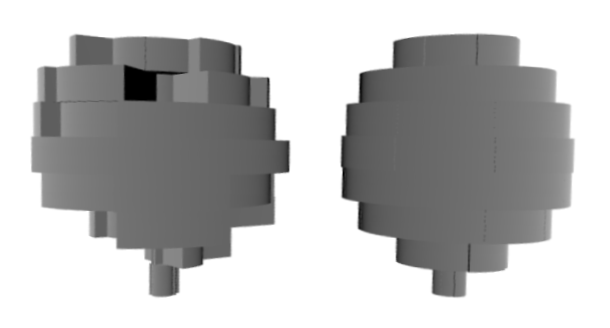
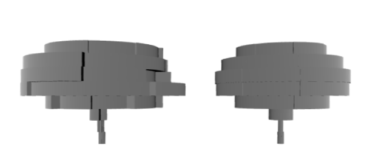

# Learning to Reconstruct Botanical Trees from Single Images 
[](https://www.python.org/)
[](https://github.com/psf/black)

### [Project Page](https://storage.googleapis.com/pirk.io/projects/single_tree_reconstruction/index.html) | [Video](https://vimeo.com/597290327) | [Paper](https://dl.acm.org/doi/pdf/10.1145/3478513.3480525)
This repository is an unofficial implementation of the paper [Learning to Reconstruct Botanical Trees from Single Images](https://storage.googleapis.com/pirk.io/projects/single_tree_reconstruction/index.html).



## Requirements
I recommend using conda environments for managing dependencies. I have provided a conda environment setup file which provides all the dependencies needed for the project. Create a conda environment by running:
```bash
conda create --name <env> --file requirements.txt
```

## Organization
The paper uses three different neural networks. One for segmenting leaves and branches, one for predicting the Radial Bounding Volume (RBV) and one for predicting the species of the tree. The repository is organized in the following directory structure:

```
botanical-trees
├── dataset                   code for data generation
├── rbv_prediction            code for training RBV prediction network
├── scripts                   SLURM scripts for training, augmentation, etc.
├── segmentation              code for training the segmentation network
└── utils                     scripts for data processing and augmentation
```

**Note**: Code for training the species classification network is not present.

## Data Generation
I have used [Blender](https://www.blender.org) along with the [Modular Tree](https://github.com/MaximeHerpin/modular_tree) to generate the dataset. The dataset includes realistic renderings of the tree, corresponding segmentation mask and the RBV. To generate your own version of the dataset use the [tree_gen.py](./dataset/tree_gen.py) script. Presets for generating different species of trees are present in [dataset/presets](./dataset/presets) directory.

## Training

### Segmentation
To train the segmentation network, run:
```bash
python segmentation/main.py <path_to_dataset> <path_to_results> --epochs 25 --batch_size 2 --num_classes 3 --encoder 'tu-xception41'
```

### RBV Prediction
To train the RBV prediction network on ground truth segmentation mask, run:
```bash
python rbv_prediction/main.py <path_to_dataset> --use_gt --gpus=1 --batch_size=32 --lr 0.001
```

**Note**: All experiments are tracked with [Weights and Biases](https://www.wandb.ai). Be sure to change the project location in `main.py` files for both networks or if you don't want experiment tracking disable WandB by running `wandb off`.

## Results
### Segmentation
<figure>
  <div style="display: flex; justify-content: space-around">
    
    
  </div>
</figure>

- [WandB Experiments](https://www.wandb.ai/ishaanshah/Tree%20Segmentation)

### RBV Prediction
<figure>
  <div style="display: flex; justify-content: space-around">
    
    
  </div>
</figure>

- [WandB Experiments](https://www.wandb.ai/ishaanshah/RBVPrediction)

## Contributing / Issues
Feel free to raise GitHub issues if you find anything concerning. Pull requests adding additional features are welcome too.

### Known Issues
The RBV prediction network is successful in predicting the overall shape of the tree however it can’t predict radii of sectors in a single layer correctly as seen in the results above. I could not figure out why this is happening so if you do, please open a PR :stuck_out_tongue_winking_eye:.


## Citation
If you find this code useful in your research then please cite the original authors.
```BibTeX
@article{10.1145/3478513.3480525,
  author = {Li, Bosheng and Ka\l{}u\.{z}ny, Jacek and Klein, Jonathan and Michels, Dominik L. and Pa\l{}ubicki, Wojtek and Benes, Bedrich and Pirk, S\"{o}ren},
  title = {Learning to Reconstruct Botanical Trees from Single Images},
  year = {2021},
  url = {https://doi.org/10.1145/3478513.3480525},
  doi = {10.1145/3478513.3480525},
  journal = {ACM Trans. Graph.},
}
```
